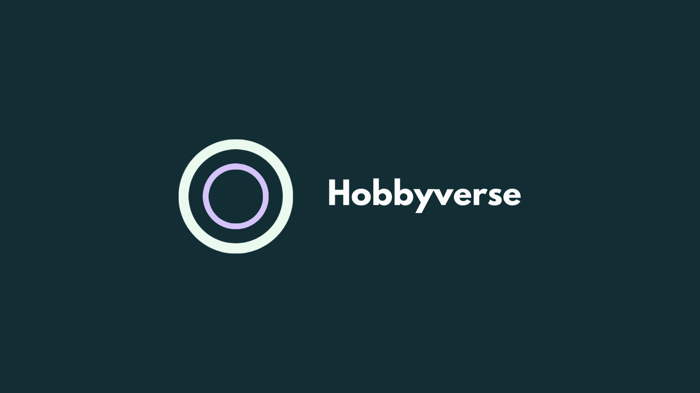

# Hobbyverse 🧬

**Hobbyverse** is an innovative mobile application that helps users discover and explore new hobbies through personalized recommendations, social connections, and gamified experiences. The app uses a unique DNA-inspired system to match users with activities that align with their personalities and interests.

## 💻 Technologies, tools & design 
**Frontend**: Typescript, React Native & Expo

**Backend**: Python Django, OpenAI API, Docker, Docker Compose

**Design**: Figma 

## 🎯 Core Features

### Discovery Tools
- Hobby Roulette: Daily personalized activity suggestions
- *Tinder-style* Hobby Tasting: Swipe-based hobby discovery

### Social Features
- Hobby Buddy: Mentor/partner matching system
- Local Events: Location-based hobby meetups and activities
- Social Feed: Share progress and connect with fellow enthusiasts

### Practical Tools
- Starter Packs: Curated beginner equipment lists with cost estimates
- Resource Saver: Pinterest-style hobby resource collection board
- Challenge System: Track 3 active hobbies and ongoing challenges

### Location Features
- Local Hobby Spots: Interactive map of hobby-related venues
- Event Discovery: Location-based hobby events and meetups

## 💻 Technical Requirements
- iOS 14.0+ / Android 8.0+
- Internet connection
- Location services
- Camera access for AR features
- Push notification capabilities

## 🤝 Community Guidelines
- Respectful interaction between users
- No commercial solicitation
- Content moderation for shared materials
- Age-appropriate content only

## 📱 User Experience
- Intuitive swipe-based interface
- Gamified discovery system
- Personalized activity feeds

## 🔄 Development Plans

### Phase 1: Core Features
- Personality assessment integration
- Initial HobbyDNA matching algorithm

### Phase 2: Enhanced Features
- Improved hobby matching algorithm using ML
- Integration of AR features for Hobby Tasting
- QR-based HobbyDNA sharing system

### Phase 3: AI Integration
- Advanced hobby matching based on user behavior
- Predictive hobby suggestions based on app usage patterns


# Project Setup Guide

## Prerequisites
- Docker and Docker Compose installed
- Node.js and npm installed
- Poetry (Python package manager) installed
- Expo Go app installed on your mobile device

## Step 1: Install Poetry
```bash
# On Windows (PowerShell)
(Invoke-WebRequest -Uri https://install.python-poetry.org -UseBasicParsing).Content | py -

# On macOS/Linux
curl -sSL https://install.python-poetry.org | python3 -
```

## Step 2: Configure Backend

1. Navigate to the backend directory and update Poetry lock file:
```bash
cd backend
poetry lock
```

2. Create a `.env` file in the backend root directory:
```
SECRET_KEY=your_django_secret_key
DEBUG=True
ALLOWED_HOSTS=localhost,127.0.0.1,<your_laptop_ip>
OPENAI_API_KEY=your_openai_api_key

POSTGRES_DB=hobbies_db
POSTGRES_USER=postgres
POSTGRES_PASSWORD=postgres
POSTGRES_HOST=db
POSTGRES_PORT=5432
```
Replace `<your_laptop_ip>` with your computer's local IP address (you can find it using `ipconfig` on Windows or `ifconfig` on Mac/Linux)

## Step 3: Start Backend Services
```bash
cd ../devtools
# Build and start the containers
docker-compose up --build
```

## Step 4: Configure Frontend

1. Create a `.env` file in the frontend root directory:
```
EXPO_PUBLIC_SERVER_URL=http://<your_laptop_ip>:8000
```
Replace `<your_laptop_ip>` with the same IP address you used in the backend configuration

2. Install dependencies and start frontend:
```bash
npm install
npx expo start
```

3. Open Expo Go on your phone and scan the QR code displayed in the terminal
   - Make sure your phone is connected to the same WiFi network as your computer

## Verify Setup
1. Backend API should be accessible at `http://<your_laptop_ip>:8000`
2. The app should open in Expo Go on your phone

## Troubleshooting

1. If Poetry installation fails:
   - Make sure you have Python 3.12 installed (required by pyproject.toml)
   - Try installing Poetry via pip: `pip install poetry`
   - Verify Poetry installation with: `poetry --version`

2. If the frontend can't connect to the backend:
   - Verify both devices are on the same network
   - Check if your laptop's IP address is correctly added to `ALLOWED_HOSTS` in backend `.env`
   - Ensure the IP address in frontend `.env` matches your laptop's IP

3. If Docker containers fail to start:
   - Check if ports 5432 or 8000 are already in use
   - Verify Docker service is running
   - View logs with `docker-compose logs`

